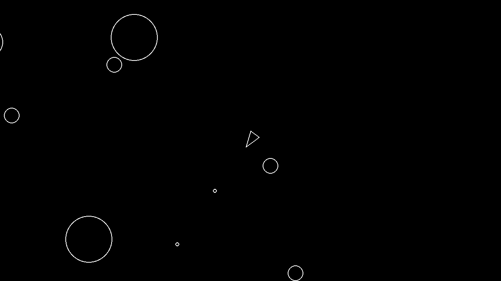

# Asteroids

A classic Asteroids clone built in Python with [pygame](https://www.pygame.org/), based on the [boot.dev](https://www.boot.dev/) "Build an Asteroids Game" course project.

Pilot a ship around the screen, shoot down waves of procedurally spawned asteroids, and watch them split into smaller ones each time you hit them.

### [▶ Play it live](https://kaz4510.github.io/Asteroid_game/)

[](https://kaz4510.github.io/Asteroid_game/)

## Features

- Ship movement and rotation with screen-wrapping physics
- Shooting with a cooldown timer
- Asteroids of three sizes that split into smaller asteroids when shot, and disappear once they're too small
- An asteroid field that continuously spawns new asteroids from the screen edges at random speeds and angles
- Circle-based collision detection between the ship, shots, and asteroids
- Score counter that increases each time an asteroid is shot
- Built-in game state/event logging (`game_state.jsonl`, `game_events.jsonl`) for debugging and replay analysis
- Playable directly in the browser (compiled to WebAssembly with [pygbag](https://github.com/pygame-web/pygbag))

## Controls

| Key     | Action        |
| ------- | ------------- |
| `W`     | Move forward  |
| `S`     | Move backward |
| `A`     | Rotate left   |
| `D`     | Rotate right  |
| `Space` | Shoot         |
| `Esc`   | Quit          |

Colliding with an asteroid ends the game.

## Getting started

This project uses [uv](https://docs.astral.sh/uv/) for dependency management.

```bash
# Install dependencies
uv sync

# Run the game
uv run main.py
```

Alternatively, with a plain virtual environment:

```bash
python -m venv .venv
source .venv/bin/activate
pip install pygame==2.6.1
python main.py
```

## Project structure

```
main.py           Game loop, collision handling, sprite groups
circleshape.py     Base class for all circular game objects
player.py          Player ship: movement, rotation, shooting
asteroid.py        Asteroid: drawing, movement, splitting on impact
asteroidfield.py    Spawns asteroids at random screen edges over time
shot.py            Projectile fired by the player
constants.py        Tunable game constants (speeds, sizes, cooldowns)
logger.py          Periodic game-state and event logging to JSONL files
```
